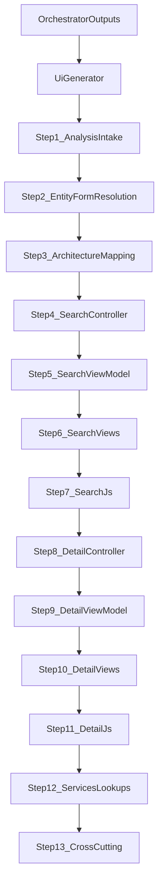

# UI Step Breakdown and Vendor Layer Mapping

## Purpose
Provide a granular, layer-aligned breakdown for the full pipeline (orchestrator to UI generator) and concrete sample outputs per step for the Vendor UI templates.

## Pipeline Context Summary
- Orchestrator runs analysis steps and produces JSON outputs under `output/{Entity}/`.
- UI generator consumes those JSON outputs and creates `conversion-plan-ui.md` plus templates under `Templates/ui/`.

### Orchestrator Analysis Outputs (Search/Detail)
The orchestrator defines steps that write analysis JSON files used by the UI generator. For standard Search/Detail pairs, the expected outputs include:
- `form-structure-search.json` (Search)
- `form-structure-detail.json` (Detail)
- `business-logic.json`
- `data-access.json`
- `security.json`
- `ui-mapping.json`
- `workflow.json`
- `tabs.json` (Detail)
- `validation.json`
- `related-entities.json`
- Optional: `child-forms.json`

For single-form entities, the same set is produced as `form-structure.json` and the rest are written under the single form folder.

### UI Generator Inputs and Outputs
- Inputs: analysis JSON files in `output/{Entity}/` (or `output/{Entity}/{FormName}` for single forms).
- Outputs:
  - `output/{Entity}/conversion-plan-ui.md`
  - `Templates/ui/` (Controllers, Services, ViewModels, Views, JS)

Source references:
- UI generator: `agents/conversion-template-generator-ui.ts`
- Wrapper: `agents/conversion-template-generator.ts`

## Vendor Layer to Folder Mapping
The Vendor image shows folders and architectural layers the UI implements. The mapping below aligns those layers to the target UI template folders.

| Vendor Layer | Target Folder | Responsibility | Sample Artifacts |
| --- | --- | --- | --- |
| Presentation: Controllers | `BargeOps.UI/Controllers` | Request routing, action orchestration, view selection | `VendorSearchController`, `VendorController` |
| Presentation: Views | `BargeOps.UI/Views` | Razor views, partials, UI layout | `Views/VendorSearch/Index.cshtml`, `_Search.cshtml` |
| Presentation: JS | `BargeOps.UI/wwwroot/js` | DataTables setup, client behaviors, filtering | `wwwroot/js/vendorSearch.js` |
| View Models | `BargeOps.UI/ViewModels` | Screen-specific state, grids, tabs | `VendorSearchViewModel`, `VendorDetailViewModel` |
| Services | `BargeOps.UI/Services` | Data access orchestration, lookups, API calls | `IVendorService`, `VendorService`, `LookupService` |
| Shared Layout/Partials | `BargeOps.UI/Views/Shared` | Shared layout, nav, partials | `_Layout.cshtml`, shared partials |

Notes:
- This mapping assumes the standard MVC folder layout shown in the Vendor UI structure.
- Adjust the mapping if the Vendor image calls out additional layers (e.g., Helpers, Components, or Infrastructure).

## Expanded Step Breakdown with Template Samples

### Step 1: Analysis Intake
Inputs: analysis JSONs from orchestrator.
Output: checklist of required inputs and detected mode (search/detail vs single-form).

Sample output (checklist excerpt):
```
- form-structure-search.json: present
- form-structure-detail.json: present
- business-logic.json: present
```

### Step 2: Entity and Form Resolution
Resolve `entity`, `formName`, `searchFormName`, `detailFormName`, `singleFormName`.

Sample output (resolution):
```
Entity: Vendor
SearchFormName: frmVendorSearch
DetailFormName: frmVendorDetail
Mode: search-detail
```

### Step 3: Architecture Mapping (Vendor Image)
Output: layer-to-folder mapping (see table above), with clear responsibilities.

Sample output (mapping snippet):
```
Controllers -> BargeOps.UI/Controllers -> request routing and actions
Views -> BargeOps.UI/Views -> search/detail screens and partials
```

### Step 4: Search Controller and Routing
Target: `BargeOps.UI/Controllers/VendorSearchController.cs`

Sample output (action signatures):
```
public IActionResult Index()
public IActionResult Search(VendorSearchRequest request)
```

### Step 5: Search ViewModel
Target: `BargeOps.UI/ViewModels/VendorSearchViewModel.cs`

Sample output (properties):
```
public string? VendorName { get; set; }
public string? VendorCode { get; set; }
public IEnumerable<VendorSearchResult> Results { get; set; }
```

### Step 6: Search Views
Targets:
- `BargeOps.UI/Views/VendorSearch/Index.cshtml`
- `BargeOps.UI/Views/VendorSearch/_Search.cshtml`
- `BargeOps.UI/Views/VendorSearch/_SearchResults.cshtml`

Sample output (partial structure):
```
@model VendorSearchViewModel
<form id="vendor-search-form">...</form>
```

### Step 7: Search JS
Target: `BargeOps.UI/wwwroot/js/vendorSearch.js`

Sample output (DataTables wiring):
```
const table = $("#vendorResults").DataTable({ serverSide: true, searching: false });
```

### Step 8: Detail Controller and Routing
Target: `BargeOps.UI/Controllers/VendorController.cs`

Sample output (action signatures):
```
public IActionResult Detail(int vendorId)
public IActionResult Save(VendorDetailRequest request)
```

### Step 9: Detail ViewModel
Target: `BargeOps.UI/ViewModels/VendorDetailViewModel.cs`

Sample output (sections):
```
public VendorHeaderViewModel Header { get; set; }
public IReadOnlyList<VendorContactViewModel> Contacts { get; set; }
```

### Step 10: Detail Views
Targets:
- `BargeOps.UI/Views/Vendor/Detail.cshtml` (or equivalent)
- Related partials for tabs and sections

Sample output (tab container):
```
<ul class="nav nav-tabs">...</ul>
<div class="tab-content">...</div>
```

### Step 11: Detail JS
Target: `BargeOps.UI/wwwroot/js/vendorDetail.js` (if used)

Sample output (validation hook):
```
$("#vendor-detail-form").on("submit", function (e) { /* validate */ });
```

### Step 12: Services and Lookups
Targets:
- `BargeOps.UI/Services/IVendorService.cs`
- `BargeOps.UI/Services/VendorService.cs`
- `BargeOps.UI/Services/LookupService.cs`

Sample output (service method signatures):
```
Task<VendorDetailViewModel> GetDetailAsync(int vendorId)
Task<DbResult> SaveAsync(VendorDetailRequest request)
```

### Step 13: Cross-Cutting Concerns
Targets: shared utilities, DataTables configuration, validation, security checks.

Sample output (validation pattern):
```
if (!ModelState.IsValid) { return BadRequest(ModelState); }
```

## High-Level Flow

