# Barge Screens - Master Conversion Plan (Top-Down)

This file is generated by `bun run barge-master-plan`.

## Flow map (legacy)

```mermaid
flowchart TB
  frmBargeSearch["frmBargeSearch (Barge Search)"]
  frmBargeDetail["frmBargeDetail (Barge Detail)"]
  frmBargeDraft["frmBargeDraft (Draft Detail)"]
  frmBargeCharters["frmBargeCharters (Charters)"]
  frmBargeTokenMap["frmBargeTokenMap (Token Map)"]
  frmBargeTokenColors["frmBargeTokenColors (Token Color Definitions)"]
  frmBargeConditions["frmBargeConditions (Barge Conditions / Photos)"]
  frmBargeEventSearch["frmBargeEventSearch"]
  frmBargeEvent["frmBargeEvent"]
  frmBargePositions["frmBargePositions"]
  frmBargePositionHistory["frmBargePositionHistory"]
  frmBargeViewConflicts["frmBargeViewConflicts"]
  frmSendTowDiagram["frmSendTowDiagram"]
  frmBargeSeriesSearch["frmBargeSeriesSearch"]
  frmBargeSeriesDetail["frmBargeSeriesDetail"]
  frmBargeDailyExpenseSearch["frmBargeDailyExpenseSearch"]
  frmBargeDailyExpenseDetail["frmBargeDailyExpenseDetail"]
  frmBargeExVendorDocInboxSearch["frmBargeExVendorDocInboxSearch"]
  frmBargeExVendorDocInboxImport["frmBargeExVendorDocInboxImport"]

  frmBargeSearch -->|"Add"| frmBargeDetail
  frmBargeSearch -->|"Modify"| frmBargeDetail
  frmBargeDetail -->|"DraftDetail"| frmBargeDraft
  frmBargeDetail -->|"BargeCharters"| frmBargeCharters
  frmBargeDetail -->|"MapColors"| frmBargeTokenMap
  frmBargeDetail -->|"DefineColors"| frmBargeTokenColors
  frmBargeDetail -->|"ViewPhotos"| frmBargeConditions
  frmBargeEventSearch -->|"Modify"| frmBargeEvent
  frmBargeEvent -->|"NewOrModifyBarge"| frmBargeDetail
  frmBargeEvent -->|"BargePositions"| frmBargePositions
  frmBargePositions -->|"History"| frmBargePositionHistory
  frmBargePositions -->|"ViewConflicts"| frmBargeViewConflicts
  frmBargePositions -->|"SendTowDiagram"| frmSendTowDiagram
  frmBargeSeriesSearch -->|"Modify"| frmBargeSeriesDetail
  frmBargeDailyExpenseSearch -->|"AddOrModify"| frmBargeDailyExpenseDetail
  frmBargeExVendorDocInboxSearch -->|"OpenBarge"| frmBargeDetail
  frmBargeExVendorDocInboxSearch -->|"Import"| frmBargeExVendorDocInboxImport
```

## Screen inventory (top-down)

### frmBargeSearch (Barge Search)

- **legacy form**: `frmBargeSearch`
- **output folder**: `output\Barge`
- **status**: `completed` (steps: 6/10, skipped: 4, failed: 0)
- **required outgoing links**:
  - (Add) → `frmBargeDetail`
  - (Modify) → `frmBargeDetail`
- **commands**:
  - analyze: `bun run agents/orchestrator.ts --entity "Barge" --form-name "frmBargeSearch"`
  - templates: `bun run generate-template --entity "Barge"`

### frmBargeDetail (Barge Detail)

- **legacy form**: `frmBargeDetail`
- **output folder**: `output\Barge`
- **status**: `completed` (steps: 6/10, skipped: 4, failed: 0)
- **required incoming links**:
  - `frmBargeSearch` → (Add)
  - `frmBargeSearch` → (Modify)
  - `frmBargeEvent` → (NewOrModifyBarge)
  - `frmBargeExVendorDocInboxSearch` → (OpenBarge)
- **required outgoing links**:
  - (DraftDetail) → `frmBargeDraft`
  - (BargeCharters) → `frmBargeCharters`
  - (MapColors) → `frmBargeTokenMap`
  - (DefineColors) → `frmBargeTokenColors`
  - (ViewPhotos) → `frmBargeConditions`
- **commands**:
  - analyze: `bun run agents/orchestrator.ts --entity "Barge" --form-name "frmBargeDetail"`
  - templates: `bun run generate-template --entity "Barge"`

### frmBargeDraft (Draft Detail)

- **legacy form**: `frmBargeDraft`
- **output folder**: `output\BargeDraft`
- **status**: `completed` (steps: 9/9, skipped: 0, failed: 0)
- **required incoming links**:
  - `frmBargeDetail` → (DraftDetail)
- **commands**:
  - analyze: `bun run agents/orchestrator.ts --entity "BargeDraft" --form-name "frmBargeDraft"`
  - templates: `bun run generate-template --entity "BargeDraft"`

### frmBargeCharters (Charters)

- **legacy form**: `frmBargeCharters`
- **output folder**: `output\Barge`
- **status**: `completed` (steps: 6/10, skipped: 4, failed: 0)
- **notes**: Often implemented as a Barge Detail tab/child grid (see Barge templates).
- **required incoming links**:
  - `frmBargeDetail` → (BargeCharters)
- **commands**:
  - analyze: `bun run agents/orchestrator.ts --entity "Barge" --form-name "frmBargeCharters"`
  - templates: `bun run generate-template --entity "Barge"`

### frmBargeTokenMap (Token Map)

- **legacy form**: `frmBargeTokenMap`
- **output folder**: `output\BargeTokenMap`
- **status**: `completed` (steps: 9/9, skipped: 0, failed: 0)
- **required incoming links**:
  - `frmBargeDetail` → (MapColors)
- **commands**:
  - analyze: `bun run agents/orchestrator.ts --entity "BargeTokenMap" --form-name "frmBargeTokenMap"`
  - templates: `bun run generate-template --entity "BargeTokenMap"`

### frmBargeTokenColors (Token Color Definitions)

- **legacy form**: `frmBargeTokenColors`
- **output folder**: `output\BargeTokenColors`
- **status**: `completed` (steps: 9/9, skipped: 0, failed: 0)
- **required incoming links**:
  - `frmBargeDetail` → (DefineColors)
- **commands**:
  - analyze: `bun run agents/orchestrator.ts --entity "BargeTokenColors" --form-name "frmBargeTokenColors"`
  - templates: `bun run generate-template --entity "BargeTokenColors"`

### frmBargeConditions (Barge Conditions / Photos)

- **legacy form**: `frmBargeConditions`
- **output folder**: `output\BargeConditions`
- **status**: `completed` (steps: 9/9, skipped: 0, failed: 0)
- **required incoming links**:
  - `frmBargeDetail` → (ViewPhotos)
- **commands**:
  - analyze: `bun run agents/orchestrator.ts --entity "BargeConditions" --form-name "frmBargeConditions"`
  - templates: `bun run generate-template --entity "BargeConditions"`

### frmBargeEventSearch

- **legacy form**: `frmBargeEventSearch`
- **output folder**: `output\BargeEvent`
- **status**: `completed` (steps: 4/10, skipped: 6, failed: 0)
- **required outgoing links**:
  - (Modify) → `frmBargeEvent`
- **commands**:
  - analyze: `bun run agents/orchestrator.ts --entity "BargeEvent" --form-name "frmBargeEventSearch"`
  - templates: `bun run generate-template --entity "BargeEvent"`

### frmBargeEvent

- **legacy form**: `frmBargeEvent`
- **output folder**: `output\BargeEvent`
- **status**: `completed` (steps: 4/10, skipped: 6, failed: 0)
- **required incoming links**:
  - `frmBargeEventSearch` → (Modify)
- **required outgoing links**:
  - (NewOrModifyBarge) → `frmBargeDetail`
  - (BargePositions) → `frmBargePositions`
- **commands**:
  - analyze: `bun run agents/orchestrator.ts --entity "BargeEvent" --form-name "frmBargeEvent"`
  - templates: `bun run generate-template --entity "BargeEvent"`

### frmBargePositions

- **legacy form**: `frmBargePositions`
- **output folder**: `output\BargePositions`
- **status**: `completed` (steps: 9/9, skipped: 0, failed: 0)
- **required incoming links**:
  - `frmBargeEvent` → (BargePositions)
- **required outgoing links**:
  - (History) → `frmBargePositionHistory`
  - (ViewConflicts) → `frmBargeViewConflicts`
  - (SendTowDiagram) → `frmSendTowDiagram`
- **commands**:
  - analyze: `bun run agents/orchestrator.ts --entity "BargePositions" --form-name "frmBargePositions"`
  - templates: `bun run generate-template --entity "BargePositions"`

### frmBargePositionHistory

- **legacy form**: `frmBargePositionHistory`
- **output folder**: `output\BargePositionHistory`
- **status**: `completed` (steps: 1/10, skipped: 9, failed: 0)
- **required incoming links**:
  - `frmBargePositions` → (History)
- **commands**:
  - analyze: `bun run agents/orchestrator.ts --entity "BargePositionHistory" --form-name "frmBargePositionHistory"`
  - templates: `bun run generate-template --entity "BargePositionHistory"`

### frmBargeViewConflicts

- **legacy form**: `frmBargeViewConflicts`
- **output folder**: `output\BargePositions`
- **status**: `completed` (steps: 9/9, skipped: 0, failed: 0)
- **required incoming links**:
  - `frmBargePositions` → (ViewConflicts)
- **commands**:
  - analyze: `bun run agents/orchestrator.ts --entity "BargePositions" --form-name "frmBargeViewConflicts"`
  - templates: `bun run generate-template --entity "BargePositions"`

### frmSendTowDiagram

- **legacy form**: `frmSendTowDiagram`
- **output folder**: `output\BargePositions`
- **status**: `completed` (steps: 9/9, skipped: 0, failed: 0)
- **required incoming links**:
  - `frmBargePositions` → (SendTowDiagram)
- **commands**:
  - analyze: `bun run agents/orchestrator.ts --entity "BargePositions" --form-name "frmSendTowDiagram"`
  - templates: `bun run generate-template --entity "BargePositions"`

### frmBargeSeriesSearch

- **legacy form**: `frmBargeSeriesSearch`
- **output folder**: `output\BargeSeries`
- **status**: `completed` (steps: 4/10, skipped: 6, failed: 0)
- **required outgoing links**:
  - (Modify) → `frmBargeSeriesDetail`
- **commands**:
  - analyze: `bun run agents/orchestrator.ts --entity "BargeSeries" --form-name "frmBargeSeriesSearch"`
  - templates: `bun run generate-template --entity "BargeSeries"`

### frmBargeSeriesDetail

- **legacy form**: `frmBargeSeriesDetail`
- **output folder**: `output\BargeSeries`
- **status**: `completed` (steps: 4/10, skipped: 6, failed: 0)
- **required incoming links**:
  - `frmBargeSeriesSearch` → (Modify)
- **commands**:
  - analyze: `bun run agents/orchestrator.ts --entity "BargeSeries" --form-name "frmBargeSeriesDetail"`
  - templates: `bun run generate-template --entity "BargeSeries"`

### frmBargeDailyExpenseSearch

- **legacy form**: `frmBargeDailyExpenseSearch`
- **output folder**: `output\BargeDailyExpense`
- **status**: `completed` (steps: 10/10, skipped: 0, failed: 0)
- **required outgoing links**:
  - (AddOrModify) → `frmBargeDailyExpenseDetail`
- **commands**:
  - analyze: `bun run agents/orchestrator.ts --entity "BargeDailyExpense" --form-name "frmBargeDailyExpenseSearch"`
  - templates: `bun run generate-template --entity "BargeDailyExpense"`

### frmBargeDailyExpenseDetail

- **legacy form**: `frmBargeDailyExpenseDetail`
- **output folder**: `output\BargeDailyExpense`
- **status**: `completed` (steps: 10/10, skipped: 0, failed: 0)
- **required incoming links**:
  - `frmBargeDailyExpenseSearch` → (AddOrModify)
- **commands**:
  - analyze: `bun run agents/orchestrator.ts --entity "BargeDailyExpense" --form-name "frmBargeDailyExpenseDetail"`
  - templates: `bun run generate-template --entity "BargeDailyExpense"`

### frmBargeExVendorDocInboxSearch

- **legacy form**: `frmBargeExVendorDocInboxSearch`
- **output folder**: `output\BargeExVendorDocInbox`
- **status**: `completed` (steps: 8/10, skipped: 2, failed: 0)
- **required outgoing links**:
  - (OpenBarge) → `frmBargeDetail`
  - (Import) → `frmBargeExVendorDocInboxImport`
- **commands**:
  - analyze: `bun run agents/orchestrator.ts --entity "BargeExVendorDocInbox" --form-name "frmBargeExVendorDocInboxSearch"`
  - templates: `bun run generate-template --entity "BargeExVendorDocInbox"`

### frmBargeExVendorDocInboxImport

- **legacy form**: `frmBargeExVendorDocInboxImport`
- **output folder**: `output\BargeExVendorDocInboxImport`
- **status**: `completed` (steps: 9/9, skipped: 0, failed: 0)
- **required incoming links**:
  - `frmBargeExVendorDocInboxSearch` → (Import)
- **commands**:
  - analyze: `bun run agents/orchestrator.ts --entity "BargeExVendorDocInboxImport" --form-name "frmBargeExVendorDocInboxImport"`
  - templates: `bun run generate-template --entity "BargeExVendorDocInboxImport"`

## Missing screens / next folders to generate

- None

## Next steps (recommended)

### 1) Generate templates for entities that don’t have `output/<Entity>/templates/` yet

- **BargeTokenMap**: `bun run generate-template --entity "BargeTokenMap"`
- **BargeTokenColors**: `bun run generate-template --entity "BargeTokenColors"`
- **BargeConditions**: `bun run generate-template --entity "BargeConditions"`
- **BargeDraft**: `bun run generate-template --entity "BargeDraft"`
- **BargePositions**: `bun run generate-template --entity "BargePositions"`  
  - Includes child forms **frmBargeViewConflicts** + **frmSendTowDiagram** (they map to `output\BargePositions`)
- **BargeDailyExpense**: `bun run generate-template --entity "BargeDailyExpense"`
- **BargeExVendorDocInbox**: `bun run generate-template --entity "BargeExVendorDocInbox"`
- **BargeExVendorDocInboxImport**: `bun run generate-template --entity "BargeExVendorDocInboxImport"`

### 2) (Optional) Deploy templates into the MonoRepo

- **Dry run**: `bun run deploy-templates --entity "<ENTITY>" --dry-run`
- **Deploy**: `bun run deploy-templates --entity "<ENTITY>"`

### Notes

- **Already has templates**: `Barge`, `BargeEvent`, `BargeSeries`, `BargePositionHistory`
- **BargeExVendorDocInbox**: analysis was run without a Detail form (steps 2 + 8 skipped), so template generation may need light cleanup/handholding.
